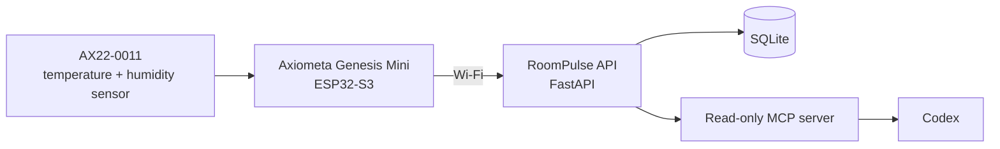

# RoomPulse: Ask Your Room

RoomPulse is a physical room-climate sensor that you can query in natural language through Codex. An Axiometa Genesis Mini reads temperature and humidity, uploads a timestamped measurement to a small API, and exposes grounded read-only MCP tools.

> “What is the temperature in my room?”
>
> “Has the humidity changed today?”

Built for **NexusHacks 2026 — AI × Robotics**.

## Why it matters

Room data is usually hidden behind an app, a display, or a raw number. RoomPulse makes a physical sensor available in the AI workspace where people already ask questions and make decisions. Every answer is grounded in a stored measurement with a timestamp and freshness status.

## System architecture



The device runs from ordinary USB power after flashing; a computer is not required. It uploads one reading per minute whenever it has Wi-Fi access.

## What is included

- Firmware for the **Axiometa Genesis Mini** and AX22-0011 DHT11 module.
- Temperature and humidity readings from `P1_IO1` / GPIO 3.
- Authenticated FastAPI ingestion API with input validation.
- SQLite storage, reading freshness, comfort bands, and trend summaries.
- Three grounded MCP tools:
  - `get_current_room_conditions`
  - `get_room_trend`
  - `explain_room_change`
- Docker deployment files, automated tests, and an MCP integration check.

## Hardware

| Part | Role |
| --- | --- |
| Axiometa Genesis Mini | Wi-Fi-enabled ESP32-S3 controller |
| AX22-0011 DHT11 | Temperature and humidity sensor in S1 |
| USB-C power adapter | Continuous power after flashing |

The AX22-0011 routes its DHT11 data line through `IO1`; the Genesis Mini board profile maps that to GPIO 3 (`P1_IO1`).

## Run locally

### API and tests

```powershell
python -m venv .venv
.\.venv\Scripts\python.exe -m pip install -e ".[test]"
.\.venv\Scripts\python.exe -m pytest -q
.\.venv\Scripts\python.exe -m uvicorn backend.app:app --host 127.0.0.1 --port 8000
```

Open [http://127.0.0.1:8000/docs](http://127.0.0.1:8000/docs) for the API documentation.

### Firmware

Install the Espressif `esp32` board package plus Adafruit's `DHT sensor library` and `Adafruit Unified Sensor` library. Then:

```powershell
arduino-cli compile --fqbn esp32:esp32:axiometa_genesis_mini firmware\roompulse
arduino-cli upload -p COM4 --fqbn esp32:esp32:axiometa_genesis_mini firmware\roompulse
```

Copy `firmware/roompulse/config.example.h` to `firmware/roompulse/config.h`, set the Wi-Fi and server values, then set `ROOMPULSE_ENABLE_UPLOAD` to `true`. `config.h` is intentionally ignored by Git and must never be committed.

### Codex MCP

Use [docs/codex-mcp-config.example.toml](docs/codex-mcp-config.example.toml) as the starting point for the local Codex configuration. With the API running, verify the integration with:

```powershell
.\.venv\Scripts\python.exe scripts\check_mcp.py
```

## API

| Method | Endpoint | Purpose |
| --- | --- | --- |
| `GET` | `/health` | Service health check |
| `POST` | `/v1/measurements` | Authenticated device upload |
| `GET` | `/v1/rooms/{room_id}/latest` | Latest timestamped reading |
| `GET` | `/v1/rooms/{room_id}/history` | Time-ordered readings |
| `GET` | `/v1/rooms/{room_id}/summary` | Comfort and trend summary |

## Deployment and security

- Use a long random `ROOMPULSE_DEVICE_TOKEN`; keep it in a private environment file.
- Bind the API to localhost behind a reverse proxy in production.
- Use HTTPS before exposing the upload endpoint publicly.
- Do not commit Wi-Fi credentials, device tokens, databases, or real sensor data.

See [docs/submission-guide.md](docs/submission-guide.md) for the hackathon submission checklist and project description.

## Sensor limits

The DHT11 is suitable for ambient comfort indication, not laboratory measurement. Treat the displayed reading as approximate, especially after rapid temperature changes or condensation.

## License

[MIT](LICENSE)
