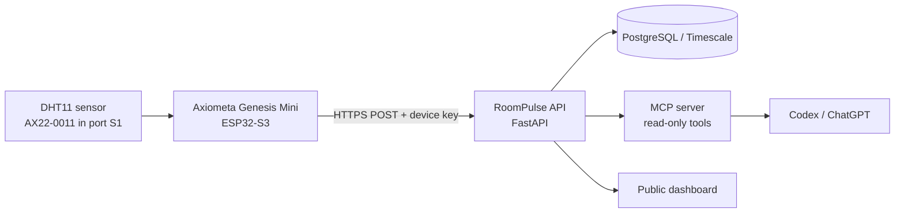

# RoomPulse

**A physical room sensor you can ask questions to.** RoomPulse turns a plug-in Axiometa Genesis Mini + DHT11 module into a secure Wi-Fi sensor, a cloud time-series API, and a natural-language interface for questions such as:

> "Is my room too humid right now?"

> "When was the room warmest today?"

Built for **NexusHacks 2026 — AI × Robotics**.

## Why this matters

Indoor comfort affects sleep, focus, and health, but the data in cheap room sensors is normally trapped on a tiny display or in a vendor app. RoomPulse makes the environment inspectable in plain language while keeping the sensing device independent of a laptop.

## What it does

- Reads temperature and relative humidity from the AX22-0011 DHT11 module.
- Sends signed measurements over Wi-Fi to a hosted API every 60 seconds.
- Keeps a time-series history and exposes current, trend, and anomaly endpoints.
- Lets an AI client query only structured live data through an MCP tool layer, avoiding invented readings.

## Architecture



The board is powered from USB-C or a USB power adapter after setup; it connects directly to Wi-Fi, so no computer has to remain connected.

## Hardware

- Axiometa Genesis Mini (ESP32-S3)
- Axiometa Temperature & Humidity module, AX22-0011 / DHT11, in port S1
- USB-C power adapter and Wi-Fi

The module is a 1 Hz single-wire DHT11. Its published accuracy is ±2 °C and ±5 % relative humidity, so RoomPulse reports readings as an ambient indicator rather than laboratory-grade values.

## Repository map

```
firmware/     ESP32 sketch
backend/      FastAPI ingestion/query service (next implementation step)
mcp/          Read-only MCP tools for Codex/ChatGPT (next implementation step)
docs/         Build and submission plan
```

## MVP build order

1. Flash `firmware/roompulse.ino` over `COM4` and confirm Serial readings.
2. Deploy the API and set `API_BASE_URL` and `DEVICE_TOKEN` in the sketch.
3. Power the board from a wall adapter and verify remote ingestion.
4. Add the MCP server to Codex/ChatGPT and demo natural-language queries.

Full setup, endpoints, deployment, demo script, and submission checklist: [docs/hackathon-plan.md](docs/hackathon-plan.md).

## Status

Scaffold created July 24, 2026. Hardware is detected on Windows as `COM4`; network credentials and hosting target are intentionally not committed.

## License

MIT
