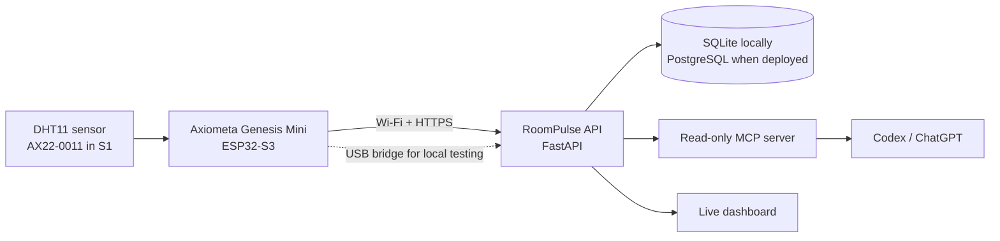

# RoomPulse

**A physical room sensor you can ask questions to.** RoomPulse turns an Axiometa Genesis Mini and its AX22 DHT11 module into a local-first climate API, a live dashboard, and grounded MCP tools for Codex or ChatGPT.

> “Is my room comfortable right now?”
>
> “When was it warmest today?”
>
> “How has humidity changed since this morning?”

Built for **NexusHacks 2026 — AI × Robotics**.

## Verified local demo

The full local path has been exercised on the real hardware:

```text
AX22-0011 in S1 → Genesis Mini on COM4 → serial bridge → FastAPI/SQLite
                                                     ↘ dashboard
                                                     ↘ MCP tools
```

Most recent hardware verification during development:

```text
Temperature: 24.8 °C
Humidity:    48.5 % RH
API status: comfortable, fresh
```

The production firmware also supports direct Wi-Fi upload so the board can run from a USB-C wall adapter without a computer.

## Architecture



AI answers are grounded in timestamped tool output. The model receives the reading age and a `stale` flag and is instructed not to invent environmental causes.

## Included

- ESP32 firmware for the exact `Axiometa Genesis Mini` Arduino board profile.
- DHT11 temperature/humidity reads from `P1_IO1` (GPIO 3), confirmed from Axiometa's AX22-0011 schematic.
- Authenticated ingestion with range validation.
- SQLite history, freshness, comfort bands, and 1–168 hour summaries.
- Read-only endpoints for latest reading, history, and trends.
- Three MCP tools:
  - `get_current_room_conditions`
  - `get_room_trend`
  - `explain_room_change`
- Responsive live dashboard with a 24-hour chart.
- USB-to-API bridge for testing real sensor data without sharing Wi-Fi credentials.
- Dockerfile, Compose file, automated tests, demo-data seed, and MCP integration check.

## Quick start on Windows

### 1. Install and test the API

```powershell
python -m venv .venv
.\.venv\Scripts\python.exe -m pip install -e ".[test]"
.\.venv\Scripts\python.exe -m pytest -q
```

Start the server:

```powershell
.\.venv\Scripts\python.exe -m uvicorn backend.app:app --host 0.0.0.0 --port 8000
```

Open [http://127.0.0.1:8000/docs](http://127.0.0.1:8000/docs) for the interactive API documentation.

### 2. Add data

For a visual demo with 24 hours of history:

```powershell
.\.venv\Scripts\python.exe scripts\seed_demo.py
```

For a real reading from the Genesis Mini currently on `COM4`:

```powershell
.\.venv\Scripts\python.exe scripts\serial_bridge.py --port COM4 --once
```

Omit `--once` to keep forwarding readings while the board remains connected.

### 3. Run the dashboard

```powershell
cd dashboard
npm install
npm run dev
```

Open the exact local URL printed by the dev server, normally [http://localhost:3000](http://localhost:3000).

### 4. Check the MCP server

Keep the API running, then:

```powershell
.\.venv\Scripts\python.exe scripts\check_mcp.py
```

The command launches the MCP server over stdio, lists all three tools, calls `get_current_room_conditions`, and confirms the result against the live API. Use [docs/codex-mcp-config.example.toml](docs/codex-mcp-config.example.toml) as the Codex configuration template.

## Firmware

The sketch lives in [`firmware/roompulse`](firmware/roompulse).

Install:

- `esp32` by Espressif Systems
- `DHT sensor library` by Adafruit

Compile and upload:

```powershell
arduino-cli lib install "DHT sensor library"
arduino-cli compile --fqbn esp32:esp32:axiometa_genesis_mini firmware\roompulse
arduino-cli upload -p COM4 --fqbn esp32:esp32:axiometa_genesis_mini firmware\roompulse
```

The committed configuration runs in sensor-only mode and prints a reading every five seconds. To enable direct Wi-Fi upload:

1. Copy `firmware/roompulse/config.example.h` to `firmware/roompulse/config.h`.
2. Set Wi-Fi, API URL, and device token.
3. Set `ROOMPULSE_ENABLE_UPLOAD` to `true`.
4. Recompile and upload.

`config.h` is ignored by Git. For a local API, use the computer's LAN address rather than `127.0.0.1`. For a hosted server, use an `https://` URL.

## API

| Method | Endpoint | Purpose |
| --- | --- | --- |
| `GET` | `/health` | Liveness check |
| `POST` | `/v1/measurements` | Token-authenticated device ingestion |
| `GET` | `/v1/rooms/{room_id}/latest` | Latest reading, age, staleness, comfort |
| `GET` | `/v1/rooms/{room_id}/history` | Time-ordered chart data |
| `GET` | `/v1/rooms/{room_id}/summary` | Min/max/average/change/trend |

The local device token is `local-development-token`. Replace it through `ROOMPULSE_DEVICE_TOKEN` before exposing the API.

## Validation

```powershell
.\.venv\Scripts\python.exe -m pytest -q
.\.venv\Scripts\python.exe scripts\check_mcp.py
cd dashboard
npm test
```

The firmware compile command above is the hardware build gate. The repository's automated suite covers authentication, input validation, CORS, persistence, comfort classification, freshness, summaries, serial parsing, and MCP tool behavior.

## Deployment path

- Run the included Python container on a VPS, Railway, Render, Fly.io, or similar.
- Mount persistent storage or replace SQLite with PostgreSQL.
- Set a long random `ROOMPULSE_DEVICE_TOKEN`.
- Put the API behind HTTPS.
- Update `config.h`, enable uploads, flash once, and power the board from the wall.
- Expose the MCP server through a secured remote transport for ChatGPT; Codex can use the included local stdio configuration immediately.

The complete NexusHacks execution and submission checklist is in [docs/hackathon-plan.md](docs/hackathon-plan.md).

## Hardware accuracy

The AX22-0011 uses a DHT11, published for 0–50 °C and 20–90% RH with ±2 °C / ±5% RH accuracy. RoomPulse presents it as an ambient comfort indicator, not laboratory-grade instrumentation.

## License

MIT
